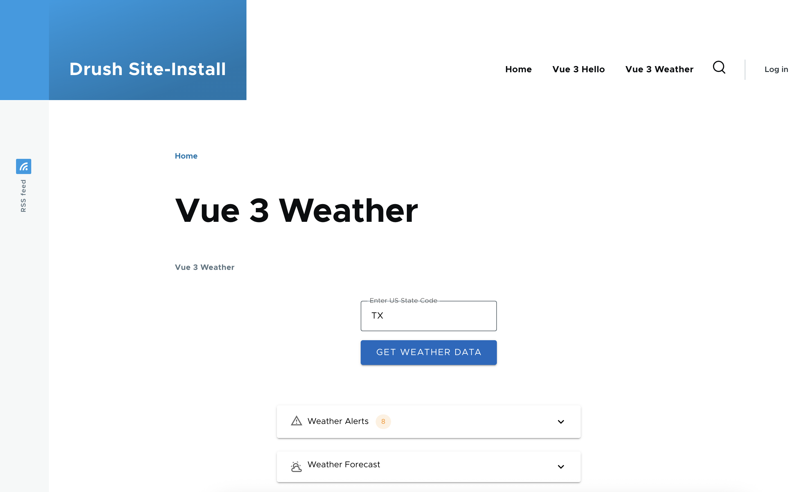

# Building and hosting Vue web apps on Drupal
This code is for the "Building and hosting Vue web apps on Drupal" presentation.

This branch shows changes required to deploy [an existing Vue.js application](https://github.com/cchew/building-vue.js) to Drupal using [Decoupled Blocks: Vue.js](https://www.drupal.org/project/pdb_vue).

1. `vue3_hello_drupalact` - based off Decoupled Blocks: Vue.js `vue3_example_1`
1. `vue3_weather` - modified `vue-deno-weather` (based off Decoupled Blocks: Vue.js `vue3_vite`) to run on Drupal using [Decoupled Blocks: Vue.js](https://www.drupal.org/project/pdb_vue). The exact changes are in this [specific commit](https://github.com/cchew/building-vue.js/commit/56a080251344a5808fb6165b78c74caf146a7a9a).

## Pre-requisites
The following will be required:

1. Drupal (DDEV) - https://ddev.readthedocs.io/en/stable/users/quickstart/#drupal
1. Decoupled Blocks: Vue.js - https://www.drupal.org/project/pdb_vue
1. Node.js - https://nodejs.org/
1. Deno - https://docs.deno.com/runtime/

## Running
After installing the pre-requisites above:

1. Git clone and checkout this branch into the Drupal modules folder.
    1.  `vue3_weather/vite.config.js` expects `web/modules/custom_vue` so change this file if you have a different subfolder.
1. In the `vue3_weather` folder, run the following commands:
```
deno install
deno run build
```
3. Enable the `PDB Vue js` module in Drupal `admin/modules` (if you have not already done so)
1. Configure `PDB Vue.js` to use 'Vue 3' in Drupal `admin/config/services/pdb-vue`
1. Add `Vue 3 Weather` to your chosen block in Drupal `admin/structure/block`('Content Above' is a good one)
1. Refresh the Drupal cache (if required) to see the weather Vue web app in Drupal



## Disclaimer
This has only been tested on MacOS so might not work on all platforms without changes.

The code in the original repository was generated using Deno CLI and Cursor.