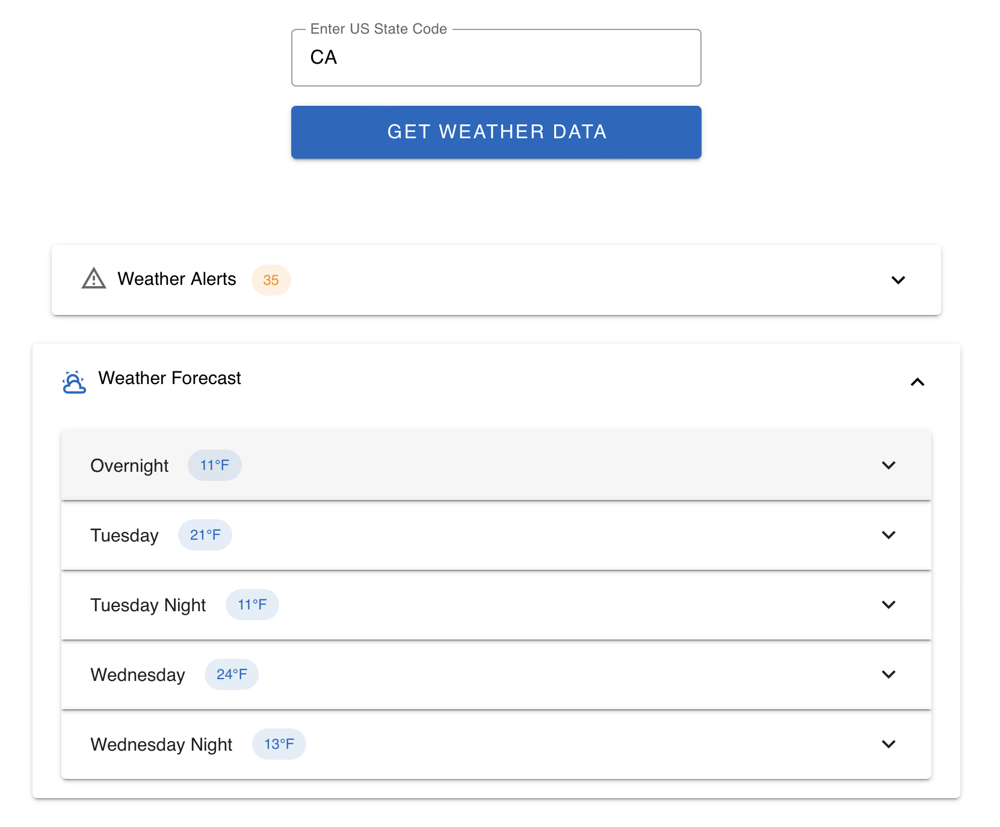

# Vue 3 weather application
Extends `vue-deno-simple` to display US state weather information using Cursor.



Uses [Veutify](https://vuetifyjs.com), [Vuex](https://vuetifyjs.com/en/), [Vue Router](https://router.vuejs.org) and [axios](https://axios-http.com).

# Commands
To run this project:

```
cd vue-deno-weather
deno install
deno run dev
```

# History
Add required packages:

```
deno add npm:vuetify
deno add npm:vuex
deno add npm:vue-router
deno add npm:@mdi/font
deno add npm:axios
```

Cursor did a great job converting [weather.py](https://github.com/modelcontextprotocol/quickstart-resources/blob/main/weather-server-python/weather.py) to Vuex (except for odd use of `const` for mutation names). 

It also successfully recommended and implemented geocoding API call so that US state codes can be converted to lat/long to retrieve weather forecast.

Styling was from "modern and minimalist" prompt.